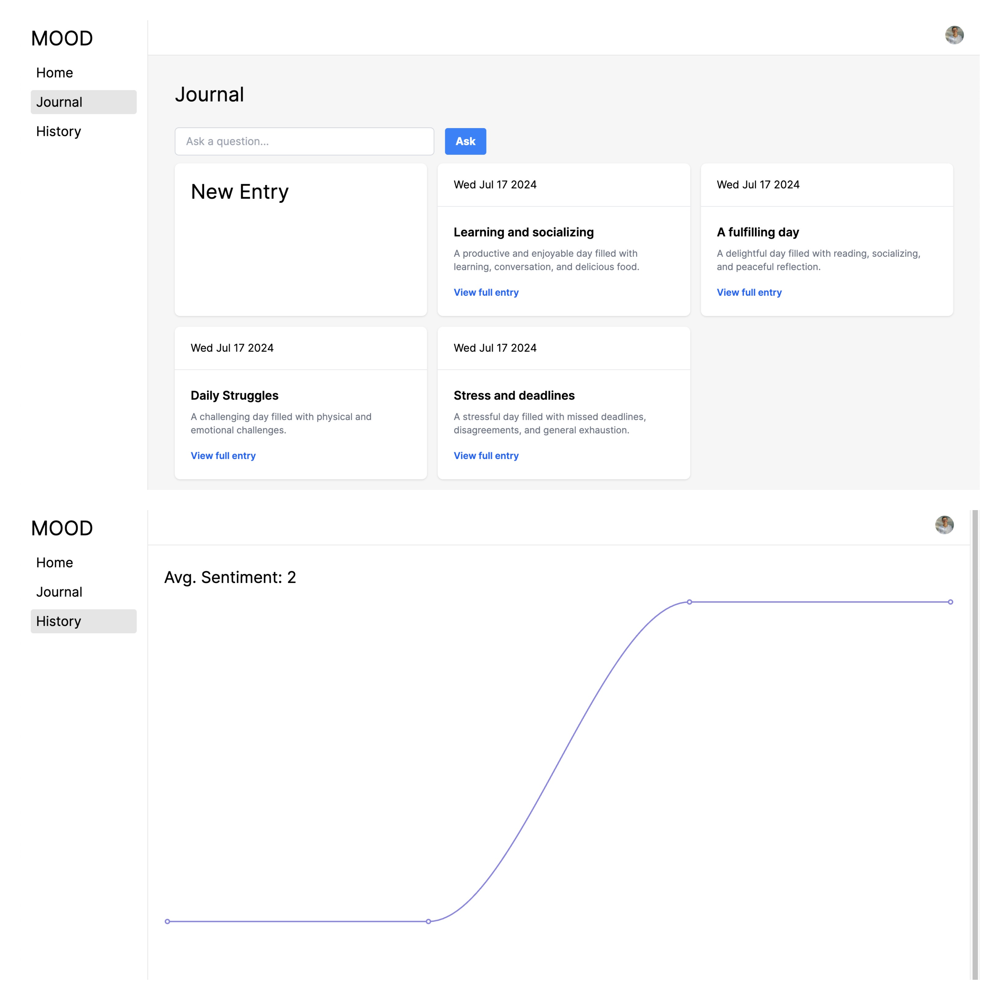

# Journal App

A journal application that allows users to log in and manage journal entries with standard CRUD operations. The entries are analyzed and given AI-generated sentiment values, summaries, and colors, providing users with a seamless experience for logging and managing their journals.

## Live Demo

Check out the [live demo of the project](https://fullstack-ai-nextjs14.vercel.app).



## Key Features

### 1. Authentication

- User registration and authentication
- Secure sign-in and sign-up processes

### 2. Journal Management

- Create, read, update, and delete journal entries
- Autosave changes while writing entries using `react-autosave`

### 3. AI Integration

- AI-generated sentiment analysis for each entry
- AI-generated summaries and color-coded feedback
- Use the search bar to get information about journals using Groq and Gemini
- Update the status of mood, summary, color, etc., using Groq and Gemini

### 4. Data Visualization

- Analyze entries and draw charts based on AI-generated sentiment values

## Technical Stack

- Framework: Next.js
- Backend & Database: Turso (serverless), Prisma
- Authentication: Clerk
- AI Integration: LangChain, Gemini, Groq
- Validation: Zod
- Testing: Vitest
- Charts: Recharts

## Packages

- **Turso:** Backend serverless solution
- **Clerk:** For sign-in, sign-up, and authentication
- **LangChain:** Simplifies AI prompt implementation
- **React-Autosave:** Enables autosave functionality for journal entries
- **Zod:** Provides schema for AI results
- **Prisma:** ORM for database management
- **Recharts:** Library for data visualization
- **Vitest:** Testing framework

## Getting Started

To get started with the project, follow these steps:

1. Clone the repository:

   ```shell
   git clone https://github.com/momensalama/fullstack-ai-nextjs.git
   ```

2. Change to the project directory:

   ```shell
   cd fullstack-ai-nextjs
   ```

3. Install the necessary dependencies:

   ```shell
   npm install
   ```

4. Run the development server:

   ```shell
   npm run dev
   ```
